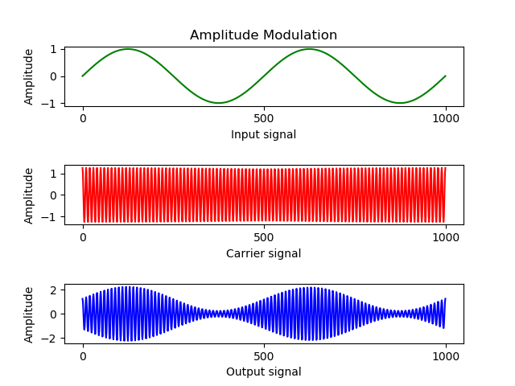

# Signal Modulation 

This repository contains solution to assignment for Principal of Communications Systems course at VJTI, Mumbai

# Generate sample data

* To generate a sample signal as the input signal, run the following command:

  ```bash
  python3 generate_signal.py
  ```

  Output of the file, enter the number of data points to generate, we take 1000 data points for this example

  ```bash
  Press 1 for sin wave
  Press 2 for cosine wave
  Enter option: 1
  Enter number of elements: 1000
    ```

  This will generate a file called `data.txt` with float values on each line.

# Amplitude Modulation

> Write a program in MATLAB/Python/Scilab (any) to generate an AM wave for a given modulation index and modulating signal. The modulation index, carrier frequency and modulating signal must be taken as input from user.

> Plot one signal below the other in a single figure as subparts, for convenient visualization.

To generate AM output signal, run the following command:
    
```bash
python3 amplitude_modulation.py
```

#### Sin signal as input

Output of python file

```bash
Enter File Name: data.txt
Enter value of modulation index (0-1): 0.5
Enter value of carrier frequency: 10000
```


#### Cosine signal as input

Output of python file

```bash
Enter File Name: data.txt
Enter value of modulation index (0-1): 0.8
Enter value of carrier frequency: 100000
```



# Frequency Modulation

> Write a program in MATLAB/Python/Scilab (any) to generate an FM wave for a given deviation ratio and modulating signal. The deviation ratio, carrier frequency and modulating signal must be taken as input from user.

> Plot one signal below the other in a single figure as subparts, for convenient visualization.

To generate FM output signal, run the following command:

```bash
python3 frequency_modulation.py
```

#### Sin signal as input


Output of the python file

```bash
Enter File Name: data.txt
Enter value of deviation ratio: 10
Enter value of carrier frequency: 1000
```


#### Cosine signal as input


Output of the python file

```bash
Enter File Name: data.txt
Enter value of deviation ratio: 10
Enter value of carrier frequency: 1000000
```


